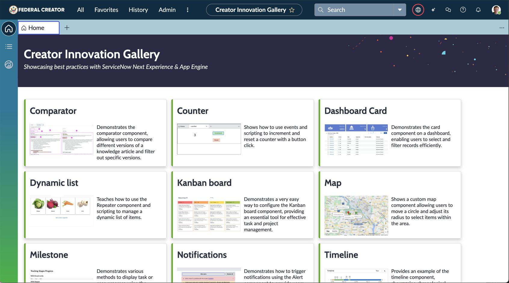

# Creator Innovation Gallery / UIB Examples

The goal of the **Creator Innovation Gallery** is to provide practical examples for building dynamic, intuitive interfaces with ServiceNow UI Builder. 

## Table of Contents

- [Pre-requisites](#Pre-requisites)
- [Versions](#versions)
- [Installation](#installation)
- [Update](#update)
- [Usage](#usage)
- [Contributing](#contributing)
- [License](#license)

## Prerequisites

The Comparator example relies on versions of a Knowledge Base (KB) article. To use this example, the **Knowledge Management Advanced** plugin must be installed. This free plugin provides advanced features for Knowledge Management, including version control and subscriptions.

## Versions

### 1.0 - October 9, 2023
- Initial release with four UI examples.

### 1.1 - October 13, 2023
- Added a missing ACL that was not packaged with the initial application version.

### 1.2 - November 18, 2023
- Added a new example: Trigger Notifications

### 1.3 - December 19, 2023
- Added a new example: Stage Tracking
- Fixed duplicate content in Notifications Example.

### 1.4 - April 26, 2024
- Added a new example: Link.

### 1.5 - May 25, 2024
- Added KB article for the comparator example.

### 1.6 - June 22, 2024
- Added a new example: Kanban Board.

### 1.7 - June 24, 2024
- Updated text and images for existing examples.

### 1.8 - January 8, 2025
- Added a new example: Visualizing Relationships: Node Map.

## Installation

Follow these steps to get the UIB-Examples running on your local ServiceNow instance:

1. Fork or clone this repository to get your own copy.
2. If not already set up, create a GitHub credential in your ServiceNow instance. [Learn how](https://support.servicenow.com/kb?id=kb_article_view&sysparm_article=KB0870863).
3. Import the project into your ServiceNow App Engine Studio.

## Update Instructions

To get the latest version, update your fork. In App Engine Studio:
1. Open the application.
2. Click on "Source control."
3. Select "Pull from repository."

## Usage

Each example in this repository is self-contained and, whenever possible, includes detailed comments explaining the implementation steps and best practices. Navigate through the examples to learn how to use and customize UI Builder components, layouts, and functionalities.

## Contributing

We welcome contributions! If you have examples or improvements, feel free to create a pull request. For major changes, please open an issue first to discuss your proposal.

### Contribution Steps:
1. Install the application in your ServiceNow instance.
2. In App Engine Studio, select "Create branch."
3. Commit your changes.
4. Push to the branch.
5. Open a pull request.

## License

This project is open source and available under the [MIT License](LICENSE).
